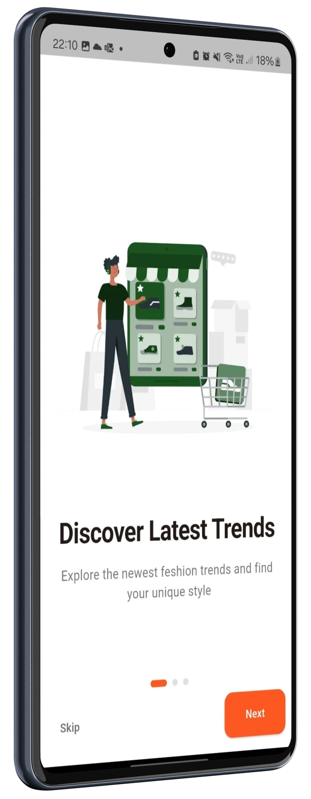
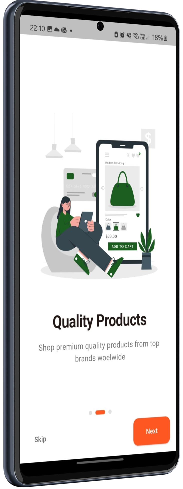
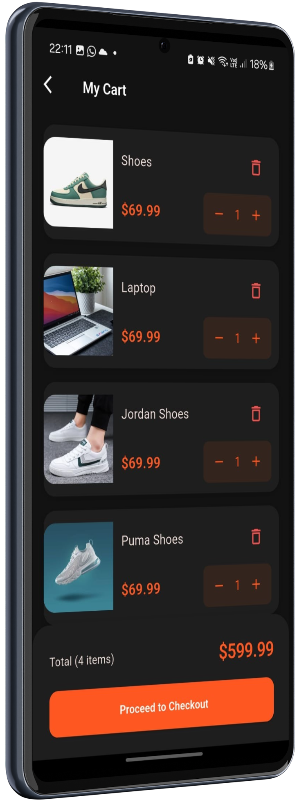
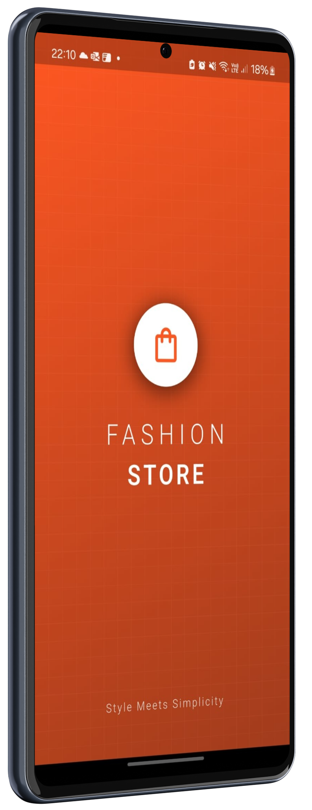

# 🛍️ Ecommerce App

Um aplicativo de **e-commerce moderno** desenvolvido em **Flutter** utilizando o **GetX** para gerenciamento de estado, navegação e injeção de dependências.  

O projeto simula uma loja virtual completa, com **cadastro, login, catálogo de produtos, carrinho de compras, dark mode e muito mais**.

---

## ✨ Funcionalidades

- 🚀 **Onboarding** com apresentação inicial do app  
- 👤 **Autenticação** (Login e Cadastro de usuários)  
- 🏠 **Tela inicial** com categorias e produtos em destaque  
- 🌙 **Tema claro e escuro**  
- ❤️ **Favoritos** para salvar produtos desejados  
- 🛒 **Carrinho de compras** com atualização em tempo real  
- 👤 **Área do usuário** (perfil, pedidos, endereço, etc.)  

---

## 🖼️ Screenshots

### 🔹 Onboarding
 
 


### 🔹 Autenticação
 


### 🔹 Home + Dark Mode e Carrinho
 

 

### 🔹 Perfil 
 


### 🔹 Splash Screen


---

## 🛠️ Tecnologias Utilizadas

- [Flutter](https://flutter.dev/)  
- [Dart](https://dart.dev/)  
- [GetX](https://pub.dev/packages/get) → State Management, Navigation e Dependency Injection  

---

## ▶️ Como Rodar o Projeto

1. Clone este repositório:
   ```bash
   git clone https://github.com/jpssa1/ecommerce_app.git
